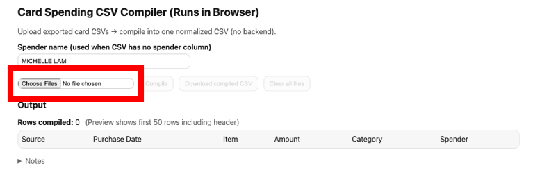
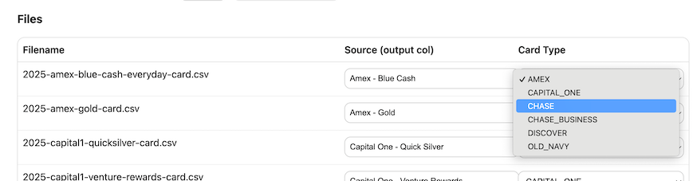

# Financial CSV Compiler
This repo is meant to generate a CSV summary of expenses to 

Pre-req: duplicate this [google sheets](https://docs.google.com/spreadsheets/d/12fIziabNlr78DHNmiQKuXEieBptjaTfjoyrLM1ZUCuk/edit?gid=2058213571#gid=2058213571)

## How to use
1. Download CSV files from your banks if supported:
    * AMEX
    * Capital One
    * Chase
    * Chase - Business
    * Discover
    * Old Navy
    * Venmo --> coming soon!
    * WealthFront --> coming soon!
3. Upload all CSVs that you want to be cleaned and combined by selecting `Choose File`: 

4. Once you've uploaded the file, you can change the card type to ensure that the uploaded CSV is for the correct card type: 

5. After uploading however number of cards you like, you can get the aggregated output by selecting `Compile` button which is next to the `Choose File` button.

6. Select `Download compiled CSV` file and use this file in the Expense + Income Tracker Template by:
    - Copy the contents from the compiled CSV
    - Paste the contents into the [`Expenses` tab of the spreadsheet](https://docs.google.com/spreadsheets/d/12fIziabNlr78DHNmiQKuXEieBptjaTfjoyrLM1ZUCuk/edit?gid=1528073380#gid=1528073380).
    - Select the pasted contents, then select `Data` dropdown in Google Sheets, and then select `Split Text to Columns`
